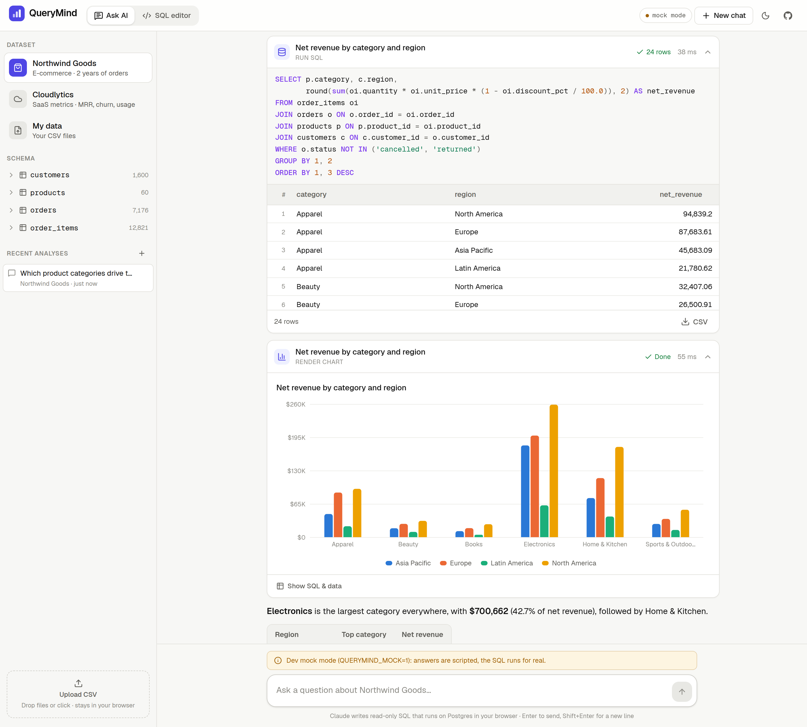
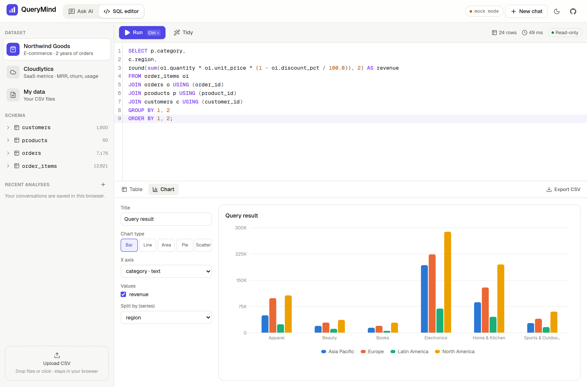
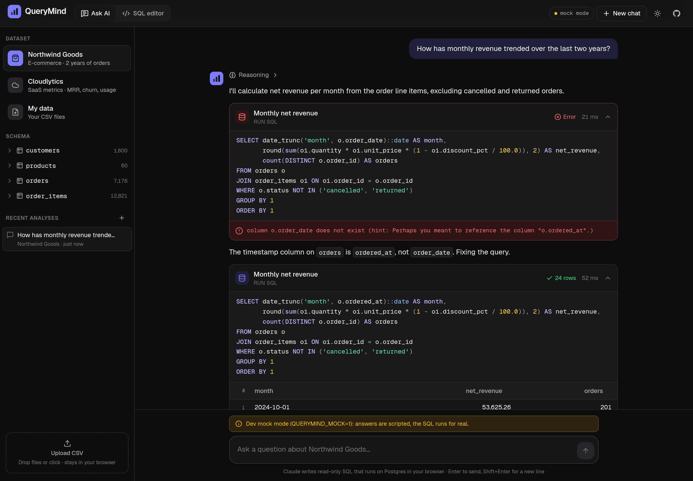
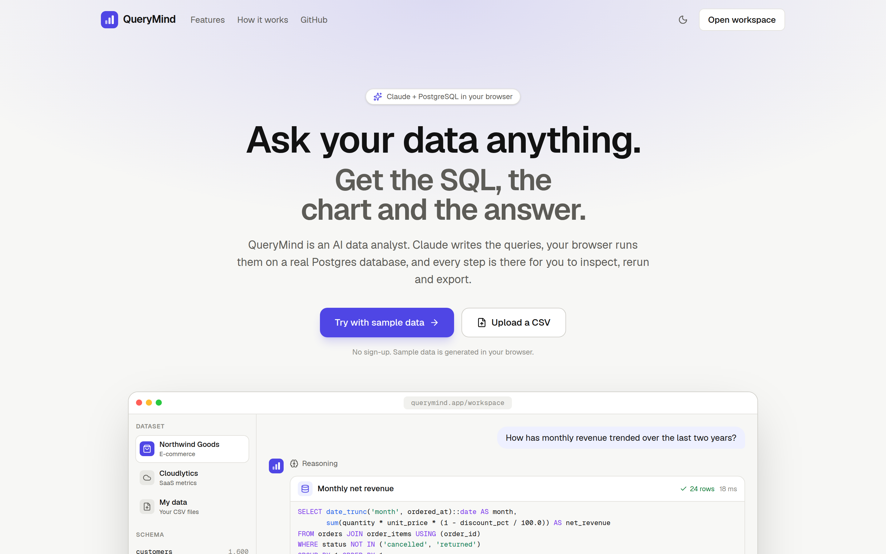
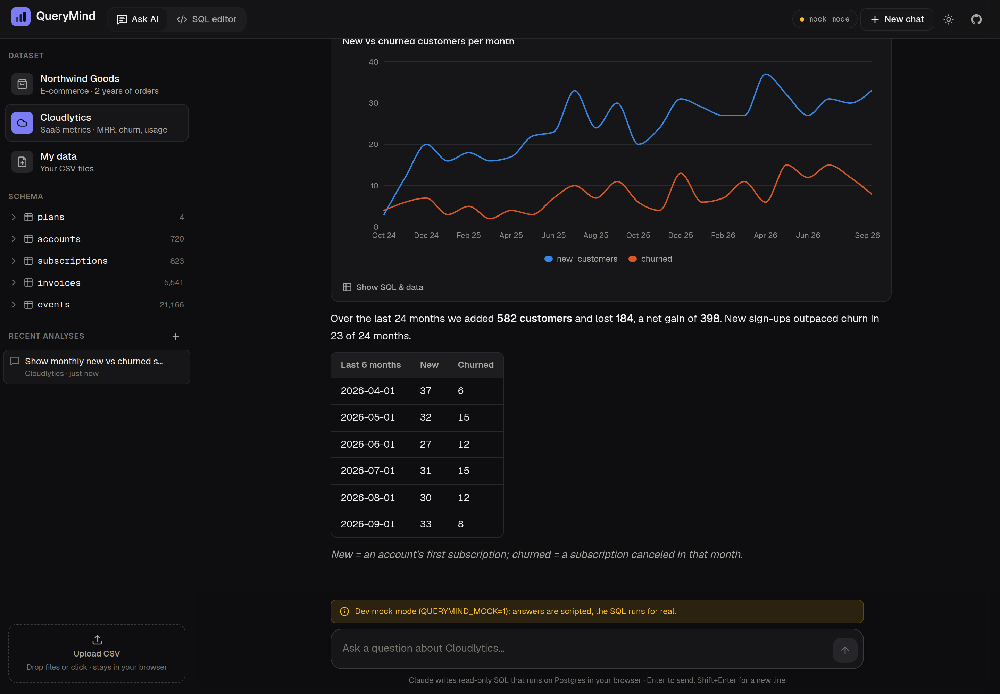
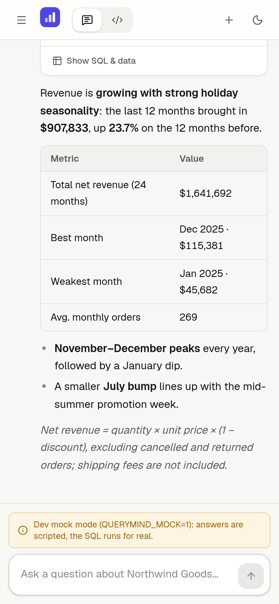
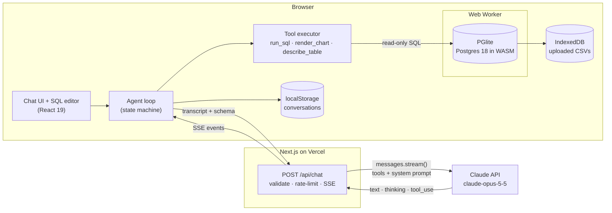
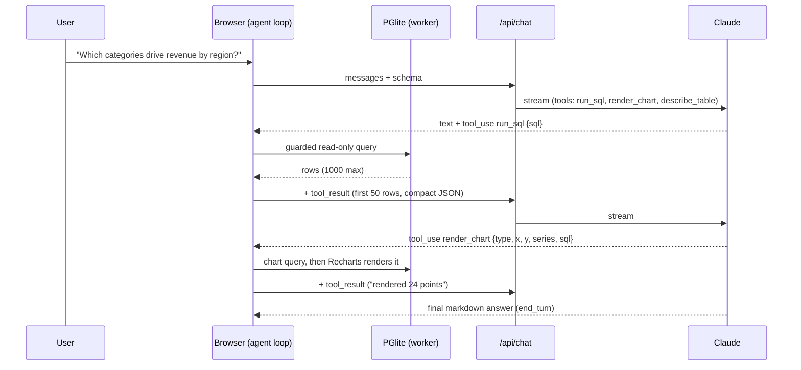

# QueryMind

**An AI data analyst that answers questions about your data with live SQL and charts.**

**[Live demo](https://querymind-lalit.vercel.app)** · [Source](https://github.com/lalitkumarrajak/querymind)

Ask a question in plain English. Claude plans the analysis and writes PostgreSQL. Your browser runs each query on a real Postgres database compiled to WebAssembly ([PGlite](https://pglite.dev)). Then you get the answer, the chart and every query behind it, ready to inspect, rerun or export.



> Screenshots were captured locally with the dev-only scripted model (`QUERYMIND_MOCK=1`, hence the "mock mode" badge). The SQL, result tables and charts are real: they come from PGlite running in the browser.

## Features

- **Agent loop with client-side tools.** Claude calls `run_sql`, `render_chart` and `describe_table`. Those tools run in the browser against PGlite, and their results stream back to Claude until it has an answer.
- **Every step is auditable.** Each tool call is a collapsible card showing the purpose, syntax-highlighted SQL (CodeMirror, read-only), execution time and a sortable result table, with charts inline. Each card has _Copy SQL_ and _Open in editor_ buttons.
- **Self-correcting.** SQL errors, including Postgres hints such as _"Perhaps you meant to reference the column o.ordered_at"_, go back to Claude so it can fix its own query.
- **Streaming UX.** Answers stream as markdown, with a collapsible reasoning summary. You also see the SQL as Claude types it. A Stop button cancels a turn instantly, even mid-tool.
- **Built-in datasets, generated in the browser** with a seeded PRNG, so they're identical on every load:
  - _Northwind Goods_ (e-commerce): 1,600 customers, 60 products, ~7.2k orders and ~12.8k line items over 2 years, with holiday seasonality, promotions, regional mix and a growing mobile channel.
  - _Cloudlytics_ (SaaS): plans, accounts, subscription history (upgrades and churn with reasons), invoices and ~21k product usage events.
- **Bring your own CSV.** Drop in one or more files. Column types are inferred (integer, bigint, numeric including `$1,234.50`, boolean, date, timestamp; IDs with leading zeros stay text). Tables live in IndexedDB, so they survive reloads.
- **SQL editor.** CodeMirror 6 with schema-aware autocomplete, Cmd/Ctrl+Enter to run, a sortable results grid, a chart builder (bar/line/area/pie/scatter, with optional series split) and CSV export.
- **Conversation history** is saved in localStorage. You can start a new chat or reopen and delete old ones.
- **Polish.** Dark and light themes, responsive layout down to phones (the sidebar becomes a drawer), loading skeletons, and clear empty and error states, including a banner when the server has no API key.

| SQL editor + chart builder                     | Self-correction (dark mode)                                   |
| ---------------------------------------------- | ------------------------------------------------------------- |
|  |  |

| Landing page                             | SaaS dataset (dark)                     | Mobile                                 |
| ---------------------------------------- | --------------------------------------- | -------------------------------------- |
|  |  |  |

## Architecture

The data never lives on a server. The Next.js route handler is a thin, stateless proxy that adds the system prompt and tool definitions, streams Claude's response as Server-Sent Events, and keeps the API key server-side.



One question usually takes a few round trips:



Key design points:

- **Append-only transcript.** The client appends Claude's assistant content _verbatim_, including thinking blocks and their signatures, and the route forwards it byte-for-byte (validated, never re-serialized). Interrupted turns are repaired by _appending_ error `tool_result`s, never by editing history. That keeps the transcript valid for the next request and the prompt cache warm.
- **Pure reducer plus a tiny store.** `src/lib/agent/state.ts` is a framework-free state machine (`idle → streaming → running_tools → … → idle | error`). React subscribes through `useSyncExternalStore`, and tests drive the same store directly.
- **Guard rails on the loop:** at most 12 model requests per question, tool input validated with Zod before execution (eager input streaming means the API doesn't validate it), `max_tokens` / `refusal` stop reasons handled, an unreadable tool call re-issued once, and AbortController cancellation all the way through.
- **Prompt caching.** Stable instructions come first and the dataset schema second, with a `cache_control` breakpoint after the schema, so follow-up requests in a conversation reuse the cached prefix.

### Model choice

The default is **`claude-opus-5-5`** (Claude Opus 5.5), Anthropic's current Opus model. Multi-step analytical reasoning and reliable tool use matter more here than raw speed. Requests use adaptive thinking with `display: "summarized"` (shown as the collapsible "Reasoning" trace) and an explicit `effort: "medium"`. They also opt into server-side refusal fallbacks (`fallbacks: "default"`). You can override the model with `ANTHROPIC_MODEL` and the effort with `ANTHROPIC_EFFORT`.

## Tech stack

| Area      | Choice                                                                                      |
| --------- | ------------------------------------------------------------------------------------------- |
| Framework | Next.js 16 (App Router), React 19, TypeScript (strict, `noUncheckedIndexedAccess`)          |
| AI        | Anthropic TypeScript SDK (`@anthropic-ai/sdk`), streaming Messages API with client tools    |
| Database  | PGlite (Postgres 18 → WASM) in a dedicated Web Worker, IndexedDB persistence for uploads    |
| UI        | Tailwind CSS v4, lucide icons, next-themes, sonner                                          |
| Editor    | CodeMirror 6 (`@uiw/react-codemirror`, `@codemirror/lang-sql`)                              |
| Charts    | Recharts, with a colour-blind-validated categorical palette tuned separately for light/dark |
| Data      | papaparse (CSV), Zod (validation), react-markdown + remark-gfm                              |
| Quality   | Vitest, MSW, ESLint (next + typescript-eslint), Prettier, GitHub Actions                    |

## Getting started

Requirements: Node.js 20.9+ (developed on Node 24) and npm.

```bash
git clone https://github.com/lalitkumarrajak/querymind.git
cd querymind
npm install
cp .env.example .env.local   # then set ANTHROPIC_API_KEY
npm run dev                  # http://localhost:3200
```

No API key yet? Run the **dev-only scripted mode**. It replays a realistic tool-use conversation (including a deliberate SQL error and the fix) through the same streaming protocol, and the SQL still runs for real in PGlite:

```bash
npm run dev:mock             # same as QUERYMIND_MOCK=1 next dev
```

Without a key (and without mock mode), the workspace still loads and shows a banner explaining the AI is unavailable. The schema explorer, SQL editor, charts and CSV upload all keep working.

### Scripts

| Script                            | What it does                                                  |
| --------------------------------- | ------------------------------------------------------------- |
| `npm run dev` / `dev:mock`        | Dev server on port 3200 (Turbopack) / with the scripted model |
| `npm run build`                   | Production build (`next build --webpack`, see note below)     |
| `npm start`                       | Serve the production build on port 3200                       |
| `npm run lint`                    | ESLint                                                        |
| `npm run typecheck`               | `tsc --noEmit`                                                |
| `npm test`                        | Vitest (unit + integration)                                   |
| `npm run format` / `format:check` | Prettier                                                      |

> **Why `--webpack` for production builds:** with Next 16.3's Turbopack production minifier, PGlite's Emscripten loader fails at runtime (`m.instantiateWasm is not a function`). The webpack production build works, and dev with Turbopack works fine. Revisit when upgrading Next.js or PGlite.

## Environment variables

| Variable                | Required     | Default           | Description                                                             |
| ----------------------- | ------------ | ----------------- | ----------------------------------------------------------------------- |
| `ANTHROPIC_API_KEY`     | yes (for AI) | –                 | Server-side only. Never prefix with `NEXT_PUBLIC_`.                     |
| `ANTHROPIC_MODEL`       | no           | `claude-opus-5-5` | Claude model id.                                                        |
| `ANTHROPIC_EFFORT`      | no           | `medium`          | `low` \| `medium` \| `high` \| `xhigh` \| `max`                         |
| `RATE_LIMIT_PER_MINUTE` | no           | `30`              | Per-IP requests to `/api/chat` (each agent step is one request).        |
| `RATE_LIMIT_PER_DAY`    | no           | `400`             | Per-IP daily cap.                                                       |
| `QUERYMIND_MOCK`        | no           | off               | `1` = scripted model. **Dev only:** ignored when `NODE_ENV=production`. |

## Deploying to Vercel

1. Push the repository to GitHub.
2. In Vercel, choose **Add New → Project** and import the repo. The framework preset (Next.js) and build command (`npm run build`) are detected automatically.
3. Under **Settings → Environment Variables**, add `ANTHROPIC_API_KEY` (Production and Preview). Optionally add `ANTHROPIC_MODEL`, `ANTHROPIC_EFFORT` and the rate limits.
4. Deploy. No database or other infrastructure is needed.
5. Optional: in the Anthropic Console, set a monthly spend limit on the key you use for the public demo.

`/api/chat` uses the Node.js runtime with `maxDuration = 300`. Each tool round trip is a separate short request, so long analyses never hit a single function timeout.

## Security notes

- **The API key stays on the server.** Only `/api/chat` reads `ANTHROPIC_API_KEY`, and the client never sees it. `/api/status` only reports whether a key is configured.
- **SQL is read-only in two layers.** (1) A tokenizer-based guard (`src/lib/sql/guard.ts`) understands strings, quoted identifiers, dollar quotes and comments. It allows exactly one `SELECT` / `WITH` / `VALUES` / `TABLE` statement and rejects DML/DDL keywords anywhere (so data-modifying CTEs, `SELECT INTO` and `FOR UPDATE` are blocked too), plus side-effecting functions (`pg_sleep`, `set_config`, `nextval`, `lo_import`, …). (2) Every query runs inside `BEGIN TRANSACTION READ ONLY` and is always rolled back. A test proves that a user-defined function which writes is stopped by layer 2. Results are capped at 1,000 rows, and the model only sees the first 50 rows within a 12k-character budget.
- **The data stays in the browser.** Datasets and uploads live in PGlite/IndexedDB. What _is_ sent to Claude: the schema, 3 sample rows per table, and the (truncated) results of queries the model runs.
- **Prompt-injection hygiene.** The system prompt tells Claude to treat cell values, table and column names as untrusted content. Markdown is rendered without raw HTML. Tools are read-only by construction, so the worst case for a malicious CSV is a misleading answer, not a write.
- **The route is hardened.** Zod validates the request schema and only accepts the block types this app produces (no images/documents/server tools). Body size and message count are capped. There is per-IP rate limiting (in-memory, per instance; swap in a shared store such as Upstash Redis if you scale out), plus basic security headers (`X-Frame-Options`, `nosniff`, `Referrer-Policy`, `Permissions-Policy`).

## Testing

```bash
npm test
```

8 test files, 101 tests:

| File                          | Covers                                                                                                                                                                                                                                                                                                        |
| ----------------------------- | ------------------------------------------------------------------------------------------------------------------------------------------------------------------------------------------------------------------------------------------------------------------------------------------------------------- |
| `tests/agent-loop.test.ts`    | **MSW**-mocked `/api/chat` streaming SSE (chunks split at awkward byte boundaries): full `tool_use → tool_result → end_turn` round trip with the verbatim transcript, invalid tool input returned as an error result, missing-API-key and streamed error events, the iteration guard, Stop mid-tool, refusals |
| `tests/agent-reducer.test.ts` | State machine transitions, draft streaming, transcript repair on stop/error, chat-turn view model                                                                                                                                                                                                             |
| `tests/sql-guard.test.ts`     | 30+ allowed/blocked statements, including tricks hidden in strings, comments and CTEs                                                                                                                                                                                                                         |
| `tests/engine.test.ts`        | Real PGlite: dataset load, keys and comments, typed results, row caps, the read-only transaction layer, Postgres error hints, table profiles, CSV import                                                                                                                                                      |
| `tests/csv-infer.test.ts`     | Type inference, value coercion, identifier sanitising                                                                                                                                                                                                                                                         |
| `tests/datasets.test.ts`      | PRNG and generator determinism, PK uniqueness and FK integrity, seasonality shape                                                                                                                                                                                                                             |
| `tests/chat-route.test.ts`    | Route handler: no-key 503, validation, dev mock stream, mock disabled in production, rate limiting                                                                                                                                                                                                            |
| `tests/helpers.test.ts`       | Chart pivoting/"Other" folding, model-facing result truncation, prompt rendering, rate limiter, CSV export                                                                                                                                                                                                    |

CI (`.github/workflows/ci.yml`) runs lint, format check, typecheck, tests and the production build on every push and PR.

## Project structure

```
src/
  app/                      landing page, /workspace, API routes (/api/chat, /api/status)
  components/
    workspace/              chat panel, step cards, result table, SQL editor panel, sidebar
    charts/                 Recharts renderer
    editor/                 CodeMirror editor/viewer + SQL extensions
    landing/                landing-page product preview
  lib/
    agent/                  tool definitions, SSE protocol, reducer, loop, executor
    db/                     PGlite engine (shared by worker + tests), worker, client
    datasets/               seeded generators for the built-in datasets
    sql/                    read-only guard
    csv/                    CSV type inference
    server/                 Claude streaming, prompt, validation, rate limit, dev mock
    storage/                localStorage persistence
tests/                      Vitest + MSW
```

## Known limitations

- The rate limiter is in-memory per server instance, which is fine for a demo but not a global quota.
- Long conversations aren't compacted. A conversation is capped at 160 messages (start a new chat after that).
- Statement timeouts aren't enforced inside PGlite (single-threaded WASM). Pathological queries can make the worker busy until the page reloads, though only the user's own tab is affected.
- Conversations created in mock mode contain placeholder thinking signatures and shouldn't be continued against the real API.

## Author

Built by **Lalit Kumar Rajak** ([@lalitkumarrajak](https://github.com/lalitkumarrajak)), a full-stack developer building agentic AI workflows.

## License

[MIT](LICENSE) © 2026 Lalit Kumar Rajak
